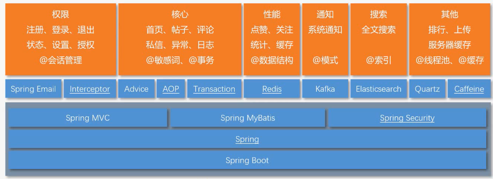

## 项目介绍
一个仿照牛客网实现的讨论社区，不仅实现了基本的注册，登录，发帖，评论，点赞，回复功能，同时使用前缀树实现敏感词过滤，实现网站UV和DAU统计，并将用户头像等信息存于七牛云服务器。

## 技术选型

## 功能简介
* 使用Spring MVC拦截器和ThreadLocal进行用户状态管理；
* 使用Trie前缀树对敏感词过滤处理；
* 使用Spring AOP对用户操作进行统一的日志记录；
* 使用Redis存储登录ticket和验证码，解决分布式session问题，使用Redis的set实现点赞，zset实现关注，HyperLogLog统计UV，Bitmap统计DAU；
* 使用Kafka处理发送评论、点赞和关注等系统通知，起到解耦和异步调用的作用；
* 对热帖排行模块，使用分布式缓存Redis和本地缓存Caffeine作为多级缓存，将QPS提升了20倍（10-200），大大提升了网站访问速度，并使用Quartz定时更新热帖排行榜。

## 运行效果展示
* 首页

* 消息

